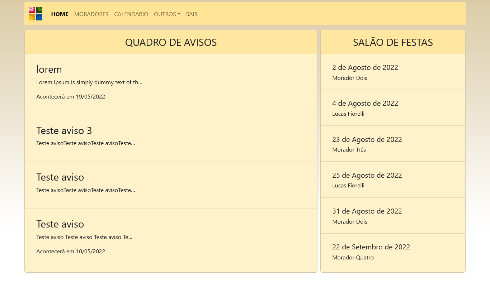
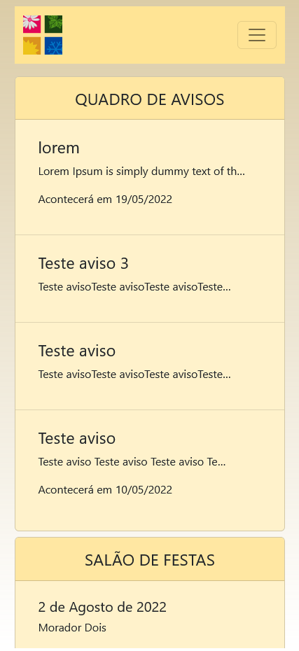

# TCC Quatro Estações

#### Status: **EM DESENVOLVIMENTO**

Projeto desenvolvido como **TCC** para o curso **Técnico em Desenvolvimento de Sistemas**, **ETEC Fernando Prestes**, pela equipe **3Tec**.

---

## Objetivo

O projeto tem como principal objetivo providenciar aos moradores do **Condomínio Quatro Estações**, uma simples e intuitiva aplicação web que possibilita o monitoramento e interação com todas as atividades do condomínio.  

---

## Recursos

- [x] Login e cadastro (realizado pelo admin)
- [x] Cadastro e listagem de moradores
- [x] Avisos para os moradores
- [x] Reclamações e sugestões
- [x] Reservas do salão de festas
- [x] Calendário
- [x] Reuniões

---

## Tecnologias utilizadas

- HTML
- CSS
- Bootstrap
- JavaScript
- Python
- Django
- Heroku
- PostgreSQL

---

## Screenshots

Home (desktop)

Home (mobile)

---

## Equipe 3Tec

- Gabriel Merlino
- Khevyn Henrique
- Lucas Fiorelli
- Samira Floriano